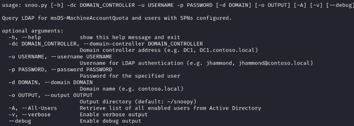

``` 
________  ________   ________  ________  ________  ___    ___ 
|\   ____\|\   ___  \|\   __  \|\   __  \|\   __  \|\  \  /  /|
\ \  \___|\ \  \\ \  \ \  \|\  \ \  \|\  \ \  \|\  \ \  \/  / /
 \ \_____  \ \  \\ \  \ \  \\\  \ \  \\\  \ \   ____\ \    / / 
  \|____|\  \ \  \\ \  \ \  \\\  \ \  \\\  \ \  \___|\/  /  /  
    ____\_\  \ \__\\ \__\ \_______\ \_______\ \__\ __/  / /    
   |\_________\|__| \|__|\|_______|\|_______|\|__||\___/ /     
   \|_________|                                   \|___|/   
                                                               
                                                @theB3an   
``` 
# SNOOPY
Snoopy is an automated AD Recon tool to perform basic information gathering from Active Directory. It will query Active Directory for commonly targeted items and outputs them for later reference and reporting after the assessment. Snoopy must be run from an authenticated context, users have the option to gather all enabled users from Active Directory or not. Automated Enumeration will include:
- All members of Domain Admins, Enterprise Admins, Administrators groups
- ASRepRoastable Users
- Kerberoastable users (identifying those in an Administrative group)
- Domain Controllers with IP resolved
- Domain trusts
- Machine Account Quota
- Domain Password Policy

Queried information is automatically saved in separate files located in `~/snoopy` by default.

#Installation
```
git clone https://github.com/theB3an/snoo.py.git
cd snoo.py/
pip3 install .
```

#Usage
